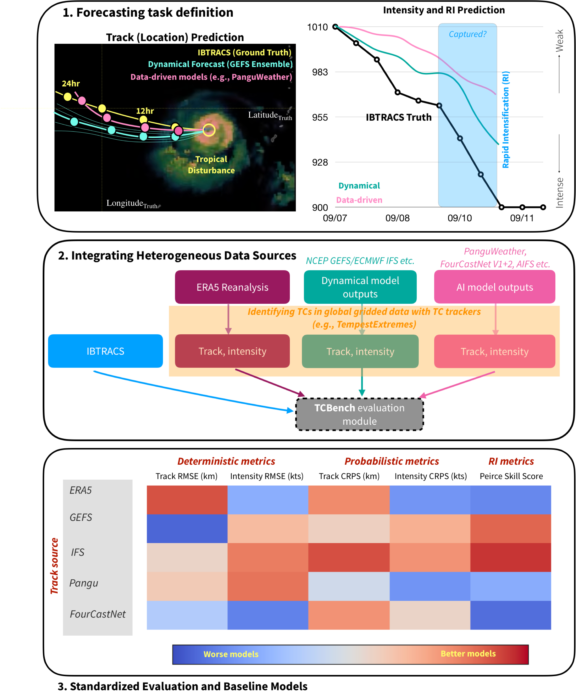

# TCBench
## A Benchmark for Global Tropical Cyclones Intensity and Track Forecasting

<div align="center">
<a href="https://tcbench.github.io"></a>
  <a href=""></a>
<a href="https://huggingface.co/datasets/TCBench/TCBench"></a>
<!-- <a href="https://github.com/leap-stc/ChaosBench/blob/main/LICENSE"></a> -->
</div>
</br>

TCBench is a benchmark dataset for evaluating medium-range (1 - 5 day) forecasts of tropical cyclone (TC) **track** and **intensity**. **Track** refers to the path that the TC takes as it moves over the ocean or land, while **intensity**, for TCBench, refers to the highest wind speesd of the TC. TCBench is built upon IBTrACS (CITE), an observational dataset of tropical cyclone track and intensity. TCBench predicts the temporal evolution of a known tropical disturbance, conditioned on the initial position and intensity of the disturbance. TCBench includes state-of-the-art physical weather models, such as TIGGE (CITE), and data-driven weather models (e.g., AIFS, Pangu-Weather, FourCastNet v2, GenCast). TCBench also provides a suite of deterministic and probabilistic evaluation metrics tailored specifically to the unique challenges and concerns of operational tropical cyclone forecasting. TCBench is designed to provide tropical meteorologists with data-driven tools and workflows to improve TC forecasting and better investigate key TC processes; and to help AI model developers address relevant, TC-specific forecasting and modeling challenges. We hope that by lowering barriers to reproducibility, providing frameworks for process-aware evaluation of extreme events, and providing guidelines for standardized TC-specific model evaluation, TCBench can help to democratize data-driven TC forecasting on a global scale. 

## Background

Tropical cyclones (TCs) are some of the most expensive and deadly natural disasters on the planet. TCs threaten coastal and inland communities with extreme winds, storm surges, heavy rainfall, and coastal and flash flooding. In the United States alone, TCs have been responsible for over \$1.5 billion in damages, and over 7,000 deaths between 1980 and 2024 (https://www.ncei.noaa.gov/access/billions/summary-stats). Accurate tropical cyclone forecasts provide actionable information at lead times sufficient for planning, evacuation, and disaster mitigation. With more than half of Earth's population projected to reside in the tropics by 2050, and more than a billion people projected to live in low-lying coastal zones by 2060 (CITE), the need for timely and accurate tropical cyclone forecasts will only increase. Currently, many operational hurricane forecast centers, including the National Hurricane Center in the U.S., successfully incorporate statistical and data-driven models into their forecasting protocols, suggesting that there are opportunities for machine learning models to provide added value to tropical cyclone forecasting. That said, while opportunities for lifesaving improvements abound, objective comparisons between models and modeling frameworks can be challenging due to a lack of unified training data and comprehensive evaluation protocols. 

## Where TCBench comes in


TCBench is designed to address some of the gaps in fusing traditional, numerical weather prediction driven forecasting and the opportunities provided by the explosion of data-driven weather prediction models in recent years by providing a framework for improving tropical cyclone forecasts with data-driven models. It should be noted that several excellent, comprehensive TC-oriented datasetse exist (CITE); TCBench builds upon these existing products and provides **added value** by adding *flexibility* and *extensibility* to accelerate model development and ultimately, TC predictive skill. Some examples of areas where TCBench adds value include the addition of additional predictive variables, savvy exploitation of the spatiotemporal structure of tropical cyclones, and a more robust assessment of data and algorithmic biases.  TCBench's open, user-friendly platform provides open preprocessing tools, domain-specific evaluation protocols and guidelines, data visualization tools, and baseline predictive models for several TC forecasting tasks. 


## Repository Structure

```bash

```

### Citation
If you find any of the code and dataset useful, feel free to cite our work through:

```bibtex

```

### Acknowledgements

The repository structure was heavily inspired by [ChaosBench](https://github.com/leap-stc/ChaosBench).
